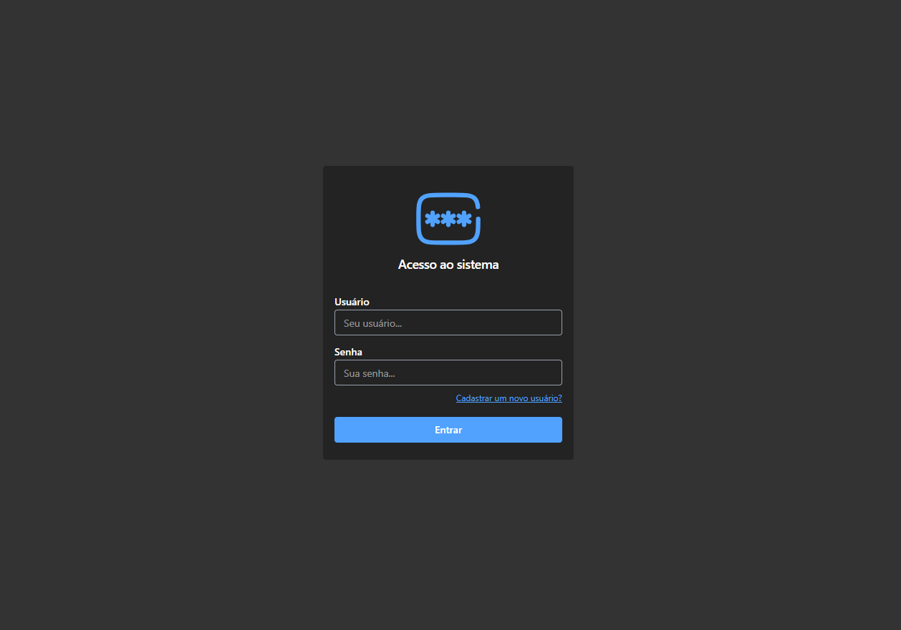
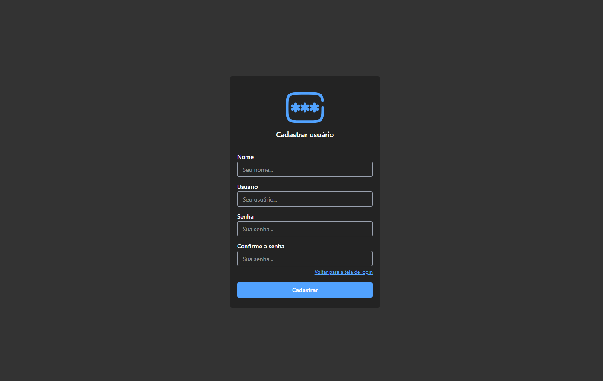
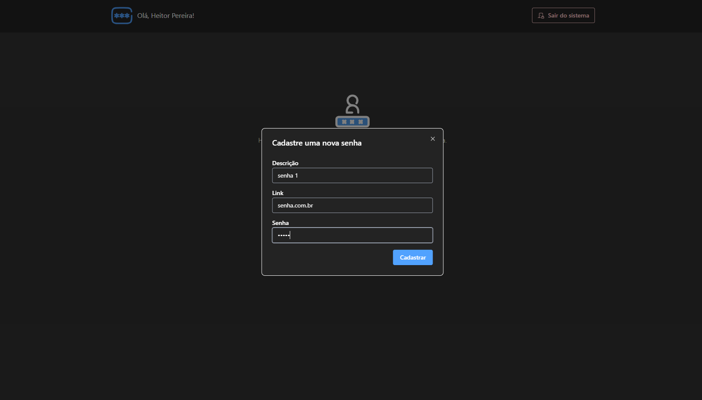
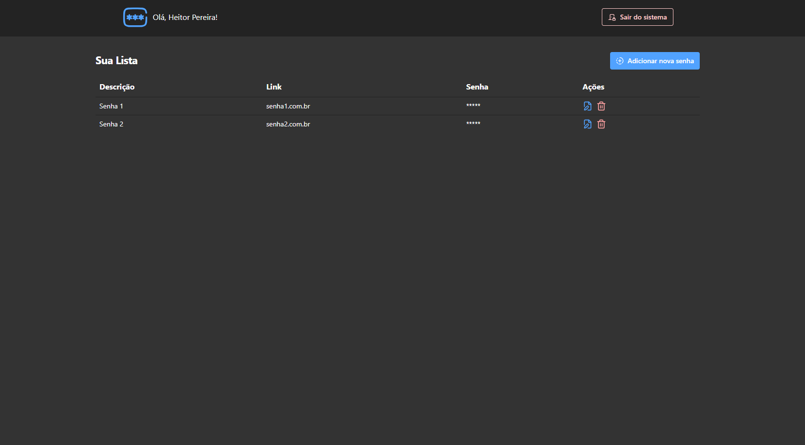

# Autenticação JWT usando GO e React.js (Gerenciador de senhas)

## 🚧 Projeto em desenvolvimento!

## Objetivo

Este projeto é um sistema para gerenciamento seguro de senhas, desenvolvido com Go (back-end) e React/Next.js (front-end).
A proposta foi praticar conceitos modernos de autenticação, segurança e boas práticas no desenvolvimento fullstack, utilizando ferramentas reais de mercado.

## Tecnologias Utilizadas

- Back-end (Go)
- Gin → framework para criação de rotas HTTP.
- JWT com Cookies → autenticação segura entre cliente e servidor.
- Criptografia de Senhas → armazenamento seguro de credenciais.
- SQLite → banco de dados leve e eficiente.
- Migrations → versionamento do esquema do banco.
- Front-end (React + Next.js)
- React / Next.js → renderização de páginas e SPA.
- Tailwind CSS → shadcn UI e Radix UI.
- React Hook Form → gerenciamento de formulários.

## Funcionalidades

- Cadastro e login de usuários
- Autenticação JWT persistida via cookies
- Criptografia de senhas armazenadas
- CRUD de senhas (adicionar, listar, editar, remover)
- Interface responsiva com Tailwind CSS
- Validação de formulários e mensagens de erro
- Migrações para versionamento do banco

## Fluxo de Autenticação

1. O usuário faz login com usuário e senha.
2. A API em Go valida as credenciais e retorna um JWT, salvo em cookie HTTPOnly.
3. O front consome as rotas protegidas, enviando automaticamente o cookie.
4. O back valida o token em cada requisição.

## Demonstração

### Login

### Cadastro de usuário

### Página inicial sem dados cadastrados

### Cadastro de nova senha

### Pagina incial com dados cadastrados

